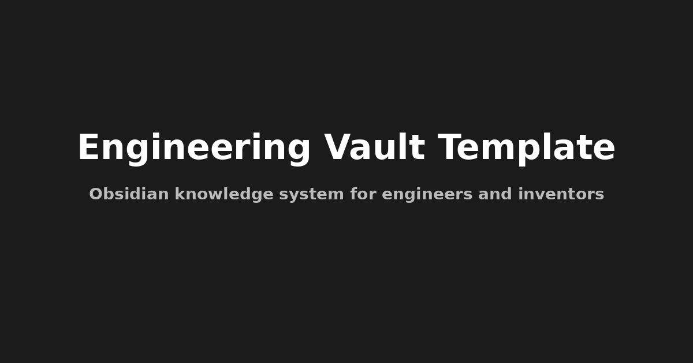

# 🧠 Engineering Vault Template (for Obsidian)

Полноценная система управления знаниями для инженеров, исследователей и изобретателей.  
Интегрирует GTD, технические заметки, проекты, эксперименты и тёмную тему в high-tech стиле.



## 🚀 Возможности

✅ Полная структура Vault  
✅ 7 продвинутых шаблонов: Идея, Проект, Эксперимент, Анализ и др.  
✅ Templater автоматизация  
✅ GTD-подход: Inbox, Next Actions, Waiting, Someday  
✅ Assistant-меню  
✅ Тематическая тёмная тема (`theme.css`)  
✅ Dataview-дэшборды  
✅ README и документация

## 🛠️ Требуемые плагины

- [Templater](https://github.com/SilentVoid13/Templater)
- [Dataview](https://github.com/blacksmithgu/obsidian-dataview)
- [Tag Wrangler](https://github.com/pjeby/tag-wrangler)
- [Advanced Tables](https://github.com/tgrosinger/advanced-tables-obsidian)
- [Calendar](https://github.com/liamcain/obsidian-calendar-plugin)
- [Kanban](https://github.com/mgmeyers/obsidian-kanban)

## 📂 Структура папок

```
📁 Obsidian Vault/
├── 01-Ideas/
├── 02-Projects/
├── 03-Knowledge/
├── 04-Sources/
├── 05-Experiments/
├── 06-Tasks/
├── 07-Analysis/
├── 08-Templates/
├── 10-System/
└── .obsidian/snippets/theme.css
```

## 🧪 Быстрый старт

1. Клонируй или скачай этот репозиторий
2. Открой как Vault в Obsidian
3. Установи и включи плагины (Templater, Dataview и др.)
4. Активируй тему: Settings → Appearance → Snippets → `theme.css`
5. Запусти Assistant-панель

---

## 🧠 Автор

[Rail73](https://github.com/Rail73)  
*Engineering • Automation • R&D • Obsidian Power-User*

---
